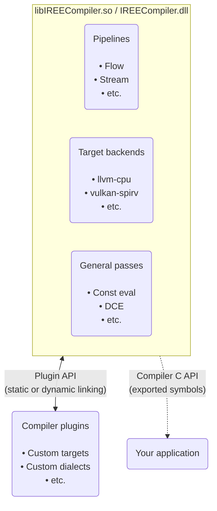

# C API bindings

!!! note - "Planning notes"

    [Discussion thread](https://discord.com/channels/689900678990135345/689900680009482386/1123726574525612032)

    - [ ] Compiler via C API
    - [ ] Runtime via C API
    - [ ] [runtime-library](https://github.com/iree-org/iree-samples/tree/main/runtime-library)
    - [ ] [iree-template-runtime-cmake](https://github.com/benvanik/iree-template-runtime-cmake)
    - [ ] [iree-template-cpp](https://github.com/iml130/iree-template-cpp)
    - [ ] `libIREECompiler.so`
    - [ ] CMake installed development packages

    > Integrators often like to link against a single runtime library, and the method of doing so is naturally owned by the integrator -- not necessarily by IREE itself (i.e. IREE will never release a full libireert.a). This separation of concerns is of practical importance because IREE's low level runtime API is fine-grained and geared towards usage via LTO style optimizations. This makes it inherently non-distributable, since every toolchain defines such features and interop differently.
    >
    > Also, it is often convenient during early development (of language bindings, etc) to simply dynamically link to something that works, even if not optimal. Because it cannot produce the best integration, IREE itself does not export a shared runtime library. However, to aid development, it can be useful for users to produce one.

## Overview

The IREE compiler and IREE runtime both have their own C/C++ APIs for use in
other projects.

!!! note

    There are multiple ways to distribute and depend on C/C++ projects, each
    with varying levels of portability, flexibility, and toolchain
    compatibility. IREE aims to support common configurations and platforms.

## Compiler API

The IREE compiler is structured as a monolithic shared object with a dynamic
plugin system allowing for extensions. The shared object exports symbols for
versioned API functions.

!!! Tip "Tip - building from source"

    When [building from source](../../building-from-source/getting-started.md),
    some components may be disabled to reduce binary size and improve build
    time. There are also options for using your own LLVM or linking in external
    target backends.



### Concepts

TODO

* Sessions
    * Plugins
* Invocations
    * Pipelines
* Sources (inputs), outputs

### Quickstart

TODO: how to obtain libIREECompiler.so, link to a sample/template project

## Runtime API

The IREE runtime is structured as a modular set of library components. Each
component is designed to be linked into applications directly and compiled
with LTO style optimizations.

Unless flexibility is needed, optional components should be disabled at build
time to reduce binary size.

The low level library components can be used directly or through a higher level
API.

=== "High level API"

    The high level 'runtime' API sits on top of the low level components. It is
    relatively terse but does not expose the full flexibility of the underlying
    systems. Components from both APIs can be intermixed.

    ```mermaid
    graph TD
      accTitle: IREE runtime high level API diagram
      accDescr {
      The IREE runtime includes 'base', 'HAL', and 'VM' components, each with
      their own types and API methods.
      A high level "runtime API" sits on top of these component APIs.
      Applications can interface indirectly with the IREE runtime via this
      high level runtime API.
      }

      subgraph iree_runtime[IREE Runtime]
        subgraph base
          base_types("Types

          • allocator
          • status
          • etc.")
        end

        subgraph hal[HAL]
          hal_types("Types

          • buffer
          • device
          • etc.")

          hal_drivers("Drivers

          • local-*
          • vulkan
          • etc.")
        end

        subgraph vm[VM]
          vm_types("Types

          • context
          • invocation
          • etc.")
        end

        runtime_api("Runtime API

        • instance
        • session
        • call")

        base_types & hal_types & hal_drivers & vm_types --> runtime_api
      end

      application(Your application)

      runtime_api --> application
    ```

=== "Low level API"

    Each runtime component has its own low level API. The low level APIs are
    typically verbose as they expose the full flexibility of each underlying
    system. Components from both APIs can be intermixed.

    ```mermaid
    graph TD
      accTitle: IREE runtime low level API diagram
      accDescr {
        The IREE runtime includes 'base', 'HAL', and 'VM' components, each with
        their own types and API methods.
        Applications can interface directly with the IREE runtime via the low
        level component APIs.
      }

      subgraph iree_runtime[IREE Runtime]
        subgraph base
          base_types("Types

          • allocator
          • status
          • etc.")
        end
        subgraph hal[HAL]
          hal_types("Types

          • buffer
          • device
          • etc.")

          hal_drivers("Drivers

          • local-*
          • vulkan
          • etc.")
        end
        subgraph vm[VM]
          vm_types("Types

          • context
          • invocation
          • etc.")
        end
      end

      application(Your application)

      base_types & hal_types & hal_drivers & vm_types --> application
    ```

API header files are organized by runtime component:

| Component header file                                                       | Overview                                                                  |
|-----------------------------------------------------------------------------|---------------------------------------------------------------------------|
| [iree/base/api.h](https://github.com/openxla/iree/blob/main/runtime/src/iree/base/api.h) | Core API, type definitions, ownership policies, utilities                 |
| [iree/vm/api.h](https://github.com/openxla/iree/blob/main/runtime/src/iree/vm/api.h)     | VM APIs: loading modules, I/O, calling functions                          |
| [iree/hal/api.h](https://github.com/openxla/iree/blob/main/runtime/src/iree/hal/api.h)   | HAL APIs: device management, synchronization, accessing hardware features |

The [samples/](https://github.com/openxla/iree/tree/main/samples)
directory demonstrates several ways to use IREE's C API.

### Concepts

By default, IREE uses its own tiny Virtual Machine (VM) at runtime to interpret
program instructions on the host system. VM instructions may also be lowered
further to LLVM IR, C, or other representations for static or resource
constrained deployment.

The VM supports generic operations like loads, stores, arithmetic, function
calls, and control flow. It builds streams of more complex program logic and
dense math into command buffers that are dispatched to hardware backends
through the Hardware Abstraction Layer (HAL) interface.

Most interaction with IREE's C API involves either the VM or the HAL.

<!-- TODO(scotttodd): diagrams -->

<!-- command buffer construction -> dispatch diagram -->
<!-- input buffers -> output buffers diagram -->
<!-- HAL interface diagram -->
<!-- VM module diagram (bytecode, HAL, custom) -->

#### VM

* VM _instances_ can serve multiple isolated execution _contexts_
* VM _contexts_ are effectively sandboxes for loading modules and running
  programs
* VM _modules_ provide extra functionality to execution _contexts_, such as
  access to hardware accelerators through the HAL. Compiled user programs are
  also modules.

#### HAL

* HAL _drivers_ are used to enumerate and create HAL _devices_
* HAL _devices_ interface with hardware, such as by allocating device memory,
  preparing executables, recording and dispatching command buffers, and
  synchronizing with the host
* HAL _buffers_ and _buffer views_ represent storage and shaped/typed views
  into that storage (aka "tensors")

### Quickstart

To use IREE's C API, you will need to build the runtime
[from source](../../building-from-source/getting-started.md). The
[iree-template-cpp](https://github.com/iml130/iree-template-cpp) community
project also shows how to integrate IREE into an external project using
CMake.

!!! todo
    TODO: Convert this to the style in
    [hello_world.c](https://github.com/benvanik/iree-template-runtime-cmake/blob/main/hello_world.c)
    and link to that file

#### Setup

Include headers:

``` c
#include "iree/base/api.h"
#include "iree/hal/api.h"
#include "iree/vm/api.h"

// The VM bytecode and HAL modules will typically be included, along
// with those for the specific HAL drivers your application uses.
// Functionality extensions can be used via custom modules.
#include "iree/modules/hal/module.h"
#include "iree/hal/drivers/local_task/registration/driver_module.h"
#include "iree/vm/bytecode/module.h"
```

Check the API version and register components:

``` c
// Device drivers are managed through registries.
// Applications may use multiple registries to more finely control driver
// lifetimes and visibility.
IREE_CHECK_OK(iree_hal_local_task_driver_module_register(
    iree_hal_driver_registry_default()));
```

!!! tip
    The `IREE_CHECK_OK()` macro calls `assert()` if an error occurs.
    Applications should propagate errors and handle or report them as desired.

#### Configure stateful objects

Create a VM instance along with a HAL driver and device:

``` c
// Applications should try to reuse instances so resource usage across contexts
// is handled and extraneous device interaction is avoided.
iree_vm_instance_t* instance = NULL;
IREE_CHECK_OK(iree_vm_instance_create(iree_allocator_system(), &instance));

// Modules with custom types must be statically registered before use.
IREE_CHECK_OK(iree_hal_module_register_all_types(instance));

// We use the CPU "local-task" driver in this example, but could use a different
// driver like the GPU "vulkan" driver. The driver(s) used should match with
// the target(s) specified during compilation.
iree_hal_driver_t* driver = NULL;
IREE_CHECK_OK(iree_hal_driver_registry_try_create(
    iree_hal_driver_registry_default(),
    iree_string_view_literal("local-task"),
    iree_allocator_system(), &driver));

// Drivers may support multiple devices, such as when a machine has multiple
// GPUs. You may either enumerate devices and select based on their properties,
// or just use the default device.
iree_hal_device_t* device = NULL;
IREE_CHECK_OK(iree_hal_driver_create_default_device(
    driver, iree_allocator_system(), &device));

// Create a HAL module initialized to use the newly created device.
// We'll load this module into a VM context later.
iree_vm_module_t* hal_module = NULL;
IREE_CHECK_OK(
    iree_hal_module_create(instance, device, IREE_HAL_MODULE_FLAG_NONE,
                           iree_allocator_system(), &hal_module));
// The reference to the driver can be released now.
iree_hal_driver_release(driver);
```

!!! tip
    The default `iree_allocator_system()` is backed by `malloc` and `free`,
    but custom allocators may also be used.

Load a vmfb bytecode module containing program data:

``` c
// (Application-specific loading into memory, such as loading from a file)

iree_vm_module_t* bytecode_module = NULL;
IREE_CHECK_OK(iree_vm_bytecode_module_create(
    instance,
    iree_const_byte_span_t{module_data, module_size},
    /*flatbuffer_allocator=*/iree_allocator_null(),
    /*allocator=*/iree_allocator_system(), &bytecode_module));
```

!!! note
    Many IREE samples use
    [`c_embed_data`](https://github.com/openxla/iree/tree/main/build_tools/embed_data)
    to embed vmfb files as C code to avoid file I/O and ease portability.
    Applications should use what makes sense for their platforms and deployment
    configurations.

Create a VM context and load modules into it:

``` c
iree_vm_context_t* context = NULL;
iree_vm_module_t* modules[2] = {hal_module, bytecode_module};
IREE_CHECK_OK(iree_vm_context_create_with_modules(
    instance, IREE_VM_CONTEXT_FLAG_NONE,
    IREE_ARRAYSIZE(modules), modules,
    iree_allocator_system(), &context));
// References to the modules can be released now.
iree_vm_module_release(hal_module);
iree_vm_module_release(bytecode_module);
```

Look up the function(s) to call:

``` c
iree_vm_function_t main_function;
IREE_CHECK_OK(iree_vm_context_resolve_function(
    context, iree_string_view_literal("module.main_function"), &main_function));
```

#### Invoke functions

<!-- TODO(scotttodd): I/O buffers (TODO pending new helpers) -->

``` c
// (Application-specific I/O buffer setup, making data available to the device)

IREE_CHECK_OK(iree_vm_invoke(context, main_function, IREE_VM_INVOCATION_FLAG_NONE,
                             /*policy=*/NULL, inputs, outputs,
                             iree_allocator_system()));

// (Application-specific output buffer retrieval and reading back from the device)
```

#### Cleanup resources

``` c
iree_hal_device_release(device);
iree_vm_context_release(context);
iree_vm_instance_release(instance);
```

## Compiler + Runtime = JIT

TODO: `iree-run-mlir`, pjrt plugin, compile "ahead of time" or "just in time"

<!-- ## Advanced usage -->

<!-- TODO(scotttodd): async execution and synchronization -->
<!-- TODO(scotttodd): specialized HAL APIs -->
<!-- TODO(scotttodd): threadpools -->
<!-- TODO(scotttodd): heterogenous execution -->

<!-- ## Troubleshooting -->

<!-- TODO(scotttodd): link to GitHub issues -->
<!-- TODO(scotttodd): compiler/runtime compatibility -->
<!-- TODO(scotttodd): common problems? object ownership? loaded modules (HAL)? -->

*[vmfb]: VM FlatBuffer
